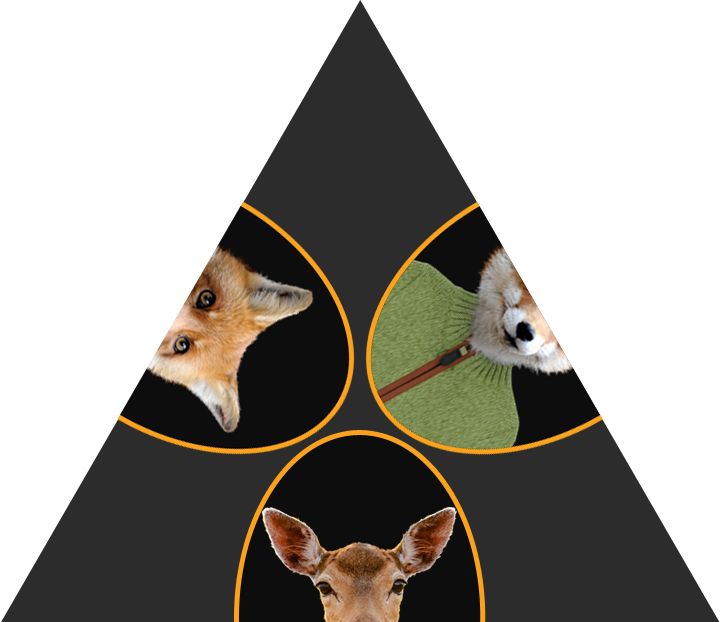
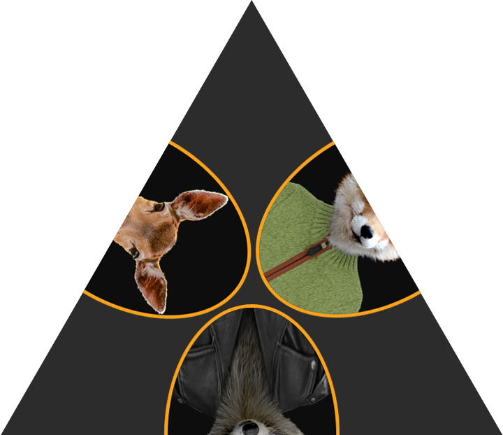
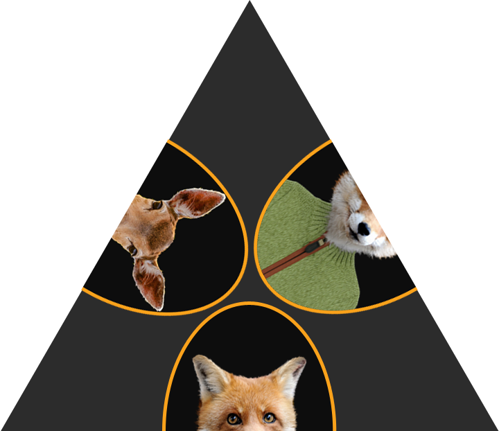
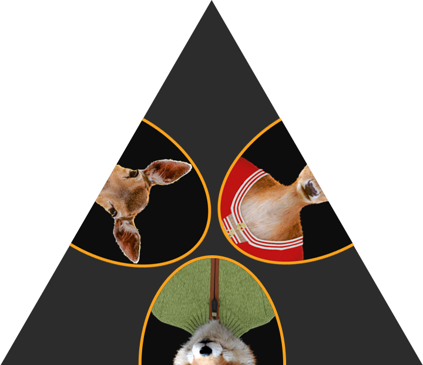
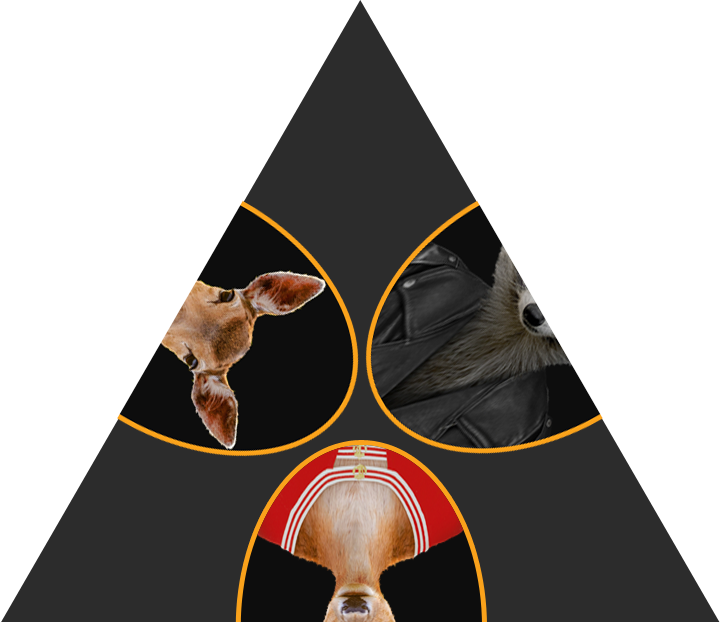
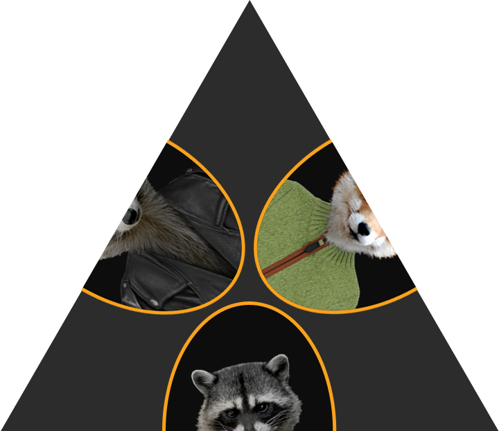
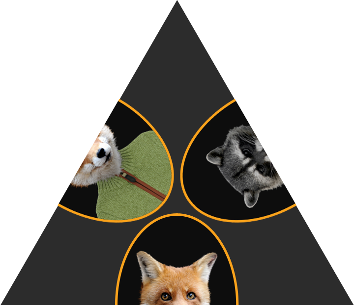
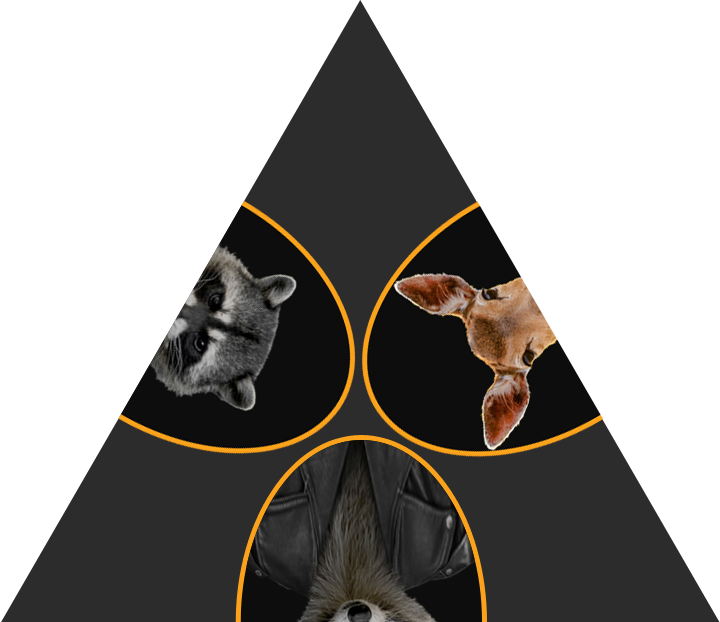
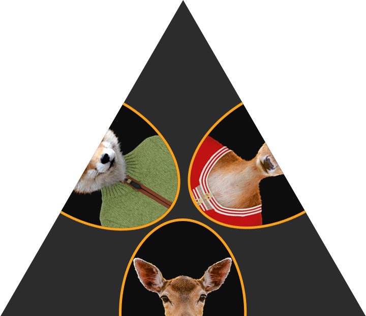
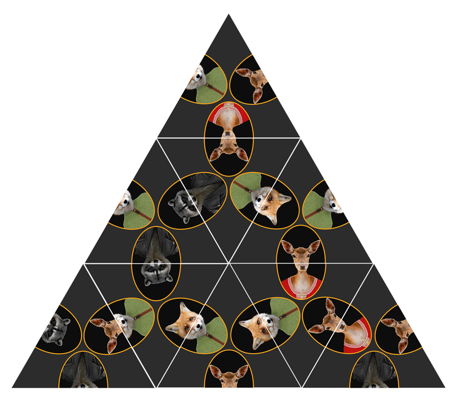

# The megakolmio awakens Wundernut

*Fall 2015*

(Find our other wundernuts [here](https://github.com/wunderdogsw/wunderpahkinas))

*"No problem is so big or so complicated that it can't be run away from!"* - Charles M. Schulz, The Complete Peanuts, 1959-1962

Release the Force and program an algorithm, which forms a grand Megakolmio out of Minikolmios. All the sides of Minikolmios from P1 to P9 have to match one another.
 
 P1

 P2

 P3

 P4

 P5

 P6

 P7

 P8

 P9

 

This is the Megakolmio, in complete:

Give your solution(s) as follows:

[P8, P6, P5, P9, P1, P4, P2, P3, P7]

In the solution, the order of the pieces matters:

The first element in the list is the top of the Megakolmio, the next element is the first of the second row and so on. You get the point. However, here’s the manual:

        1               P8

      2 3 4          P6 P5 P9

    5 6 7 8 9     P1 P4 P2 P3 P7

Rules

You can participate in a programming language of your choice. We don’t discriminate.
Hot tip: Brute force solution is not elegant.

 

 

SAMA SUOMEKSI
 
Päästä Voima valloilleen ja koodaa algoritmi, jolla saat Minikolmioista suuren Megakolmion. Minikolmioiden sivujen pitää sopia yhteen.

Anna ratkaisu tai ratkaisut seuraavassa muodossa:

[P8, P6, P5, P9, P1, P4, P2, P3, P7]

Ratkaisussa palojen järjestyksellä on merkitystä:

Listan ensimmäinen pala on Megakolmion huippu, listan toinen pala on toisen rivin ensimmäinen ja…noh...ymmärtänet asian. Rakennusoppaan löydät kaaviosta:

        1               P8

      2 3 4          P6 P5 P9

    5 6 7 8 9     P1 P4 P2 P3 P7

 
 **Säännöt**

Osallistua voit millä ohjelmointikielellä tahansa. Emme syrji. 
Vinkki: Brute force -ratkaisu ei ole elegantti.

HOW TO CRACK IT?

 
The winner of our third Wundernut is Kimmo Kiiski! Congrats!

The Megakolmio Awakens was our most challenging wundernut so far. We didn't get quite as many solutions as before, but these were of a better quality. The level of solutions was very high, written in several different languages, which of the most popular was Python. Other used languages were C++, Go, JavaScript, C#, Clojure, EppaBasic, Haskell, Java, MiniZinc, PHP, Ruby ja Scala. 

Our wunderdogs gathered together to read solutions and to select the most elegant solution to win. The winner solution had clever algorithm and it was simple and clean. 

There are total of 6 correct solutions. Two of them are unique arrangements and the rest are different rotations of The Megakolmio. See the correct solutions below: 

 

Historiamme kolmannen Wunderpähkinän voittaja on Kimmo Kiiski! Onnea!

The Megakolmio Awakens oli haastavin pähkinämme tähänastisista. Saimme yhteensä vähemmän vastauksia verrattuna aikaisempiin pähkinöihimme, mutta laadultaan parempia. Ratkaisujen taso oli erittäin kova ja niissä käytettiin monia eri ohjelmointikieliä, joista yleisin oli Python. Muita käytettyjä kieliä olivat C++, Go, JavaScript, C#, Clojure, EppaBasic, Haskell, Java, MiniZinc, PHP, Ruby ja Scala.

Pähkinäraatimme kokoontui tarkastelemaan vastauksia ja valitsi mielestään eleganteimman ratkaisun voittajaksi. Voittajaratkaisussa oli nokkela algoritmi, minkä lisäksi se oli selkeä, siisti ja kompakti. 

Oikeita ratkaisuja on 6, joista kaksi on uniikkia ja loput megakolmion käännöksiä niistä. Alla oikeat vastaukset:

[ P1, P3, P7, P6, P5, P9, P4, P8, P2 ]
[ P2, P6, P8, P4, P1, P7, P3, P9, P5 ]
[ P3, P1, P4, P5, P9, P2, P7, P6, P8 ]
[ P5, P4, P9, P3, P2, P8, P6, P7, P1 ]
[ P8, P5, P6, P7, P3, P4, P1, P2, P9 ]
[ P9, P7, P2, P1, P8, P6, P5, P4, P3 ]